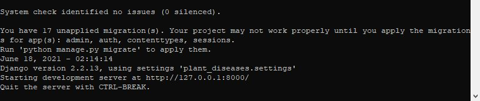
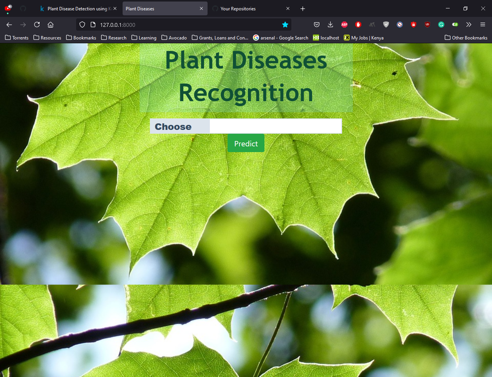
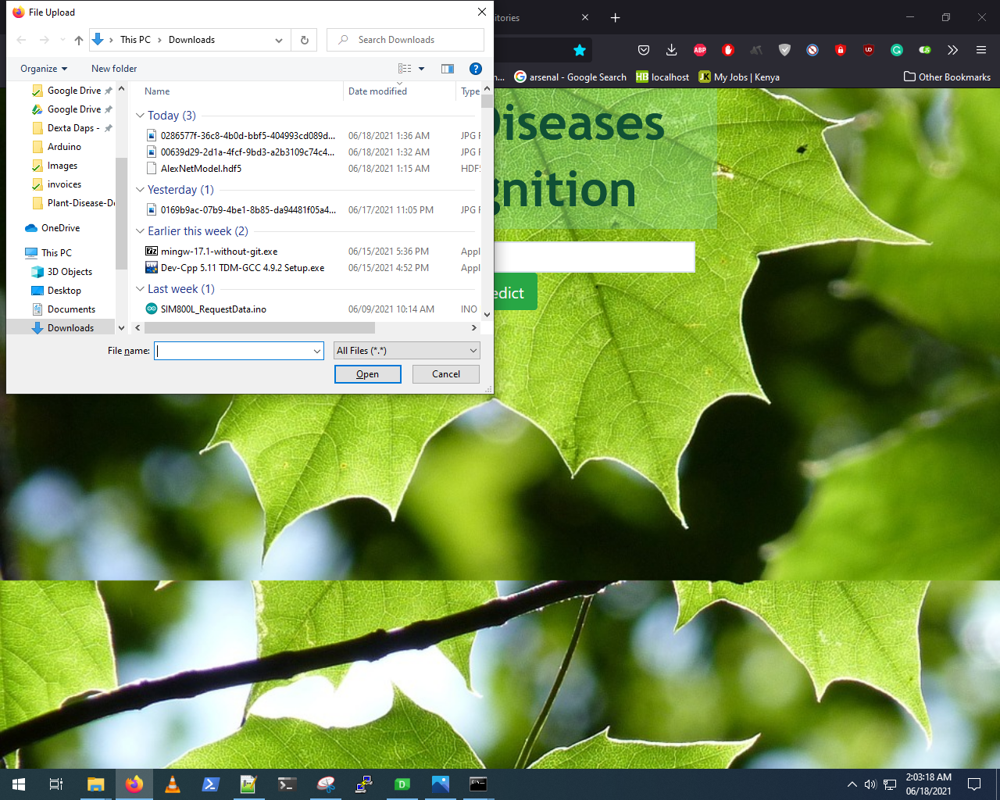
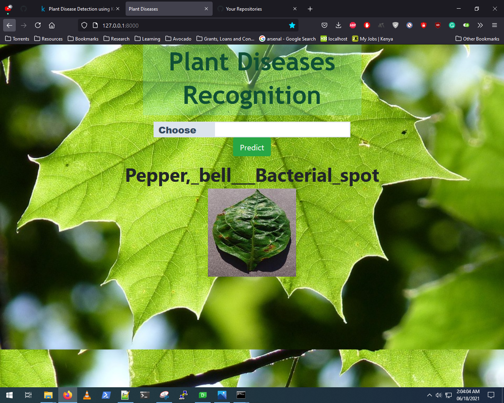

# Deep Learning Based Plant Diseases Recognition
  This simple website uses a CNN to predict the disease on a plant leaf. It consists of 38 classes of 
  different healthy and diseased plant leaves. These classes are:
  
  01. Apple-> Apple scab
  02. Apple-> Black rot
  03. Apple-> Cedar apple rust
  04. Apple-> healthy
  05. Blueberry-> healthy
  06. Cherry-> Powdery mildew
  07. Cherry-> healthy
  08. Corn-> Cercospora leaf spot (Gray leaf spot)
  09. Corn-> Common rust
  10. Corn-> Northern Leaf Blight
  11. Corn-> healthy
  12. Grape-> Black rot
  13. Grape-> Esca (Black Measles)
  14. Grape-> Leaf blight (Isariopsis Leaf Spot)
  15. Grape-> healthy
  16. Orange-> Haunglongbing (Citrus greening)
  17. Peach-> Bacterial spot
  18. Peach-> healthy
  19. Pepper, bell-> Bacterial spot
  20. Pepper, bell-> healthy
  21. Potato-> Early blight
  22. Potato-> Late blight
  23. Potato-> healthy
  24. Raspberry-> healthy
  25. Soybean-> healthy
  26. Squash-> Powdery mildew
  27. Strawberry-> Leaf scorch
  28. Strawberry-> healthy
  29. Tomato-> Bacterial spot
  30. Tomato-> Early blight
  31. Tomato-> Late blight
  32. Tomato-> Leaf Mold
  33. Tomato-> Septoria leaf spot
  34. Tomato-> Spider mites (Two-spotted spider mite)
  35. Tomato-> Target Spot
  36. Tomato-> Tomato Yellow Leaf Curl Virus
  37. Tomato-> Tomato mosaic virus
  38. Tomato-> healthy

# Requirements:
  01. Python
  02. Tensorflow
  03. Keras
  04. Django
  05. PIL
  06. Numpy
  
# Steps to run the application:
**This application requires Python 3.6 or higher**

  01. Download the repository by clicking on the download button or type the following command in CMD to clone the repository:
      
      `git clone https://github.com/ayieko168/Plant-Disease-Detector.git`

  02. Download model from the following link and paste it in the `\plant_diseases\plant_app` folder: 
    https://drive.google.com/file/d/1FZXraDDPqbRTX-QeiQclfojgtoLddxQ_/view

  03. (Optional) Create a virtual enviourment. Refer this tutorial to learn how to create a virtual enviourment:
    https://www.youtube.com/watch?v=APOPm01BVrk
    **If you create a virtual enviourment, make sure it is activated and you execute all commands from within the virtual enviournment. Skip this step if you are unsure about how it works.**

  04. Install required packages:
      
      `pip install -r requirements.txt`

  05. Navigate to `\plant_diseases` directory and run the application with the following command:
      
      `python manage.py runserver`

  06. A link will appear in your command prompt. Copy this link and paste it in your browser, press enter.
    

  07. Your application is running. Choose any infected image to get results.

# install Python3.6 (Ubuntu)
    
  01. Open terminal via Ctrl+Alt+T or searching for “Terminal” from app launcher. When it opens, run command to add the PPA:
    
        ``sudo add-apt-repository ppa:jonathonf/python-3.6``

  02. Then check updates and install Python 3.6 via commands:

        - `sudo apt-get update`
        - `sudo apt-get install python3.6`
    
  3. Check if python 3.6 was installed properly
        `python3 -V`

# Get sample pictures

  01. You can get sample pictures from here: https://www.kaggle.com/abdallahalidev/plantvillage-dataset
    
# Screenshots
  
  

  

  

